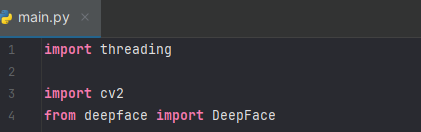

# Documentation Update 4.28.24

Date: 
On April 17, I dedicated some time doing base research on facial detection. The resources that assisted me was Campus.Datacamp.Com, Reddit, and Youtube. 

Features added / updated since the last update
Using VS Code, I imported threading, cv2, & deepface. 

The threading module allows my project to generate and handle threads in python. It basically enables my code which is beneficial for my opertion for facial detection. 

The CV2 libary is a open source library for computer vision & image reading. This libary is used in variety of tasks that partakes in pictures or recordings detections. 

The Deepface package is the thing that ties it all, this operate facial recognition analyis. This offers the API for processing projects for facial verficiation , recognition and feature readings. 

Issues that you ran into
My Pycharm program had a hard time processing the proper installment for these libraries. It's not a easy as typing out import to have all the proper tools to be provided to you. I had to figure out what was the proper terminal installment for these. 

Any lessons learned during this period
I obtained a great knowledge regarding CV2 and Deepface and how its used for other tasks. 
 
